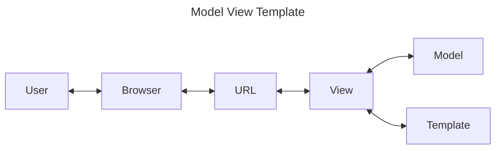

# What is Django?
- Django là một framework mạnh mẽ, phát triển dễ dàng, nhanh chóng các ứng dụng web phức tạp.  
- Django hoạt động theo mô hình `MVT - Model, View & Template`  

```mermaid
---
title: Model View Template 
---
graph LR;
      User <--> Browser;
      Browser <--> URL;
      URL <--> View;
      View <--> Model;
      View <--> Template;
```