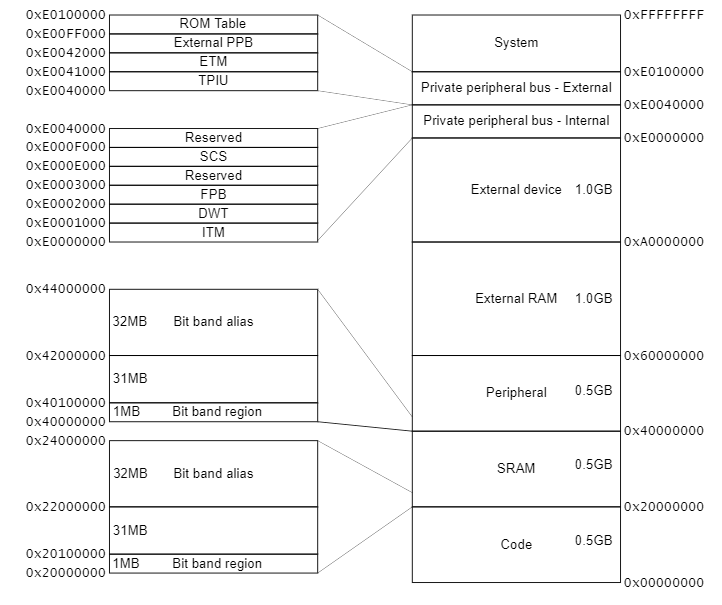
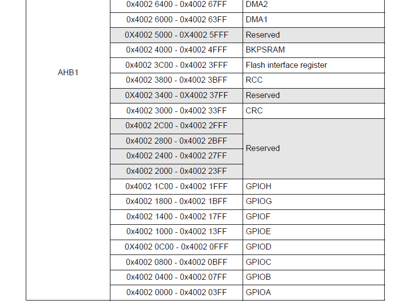
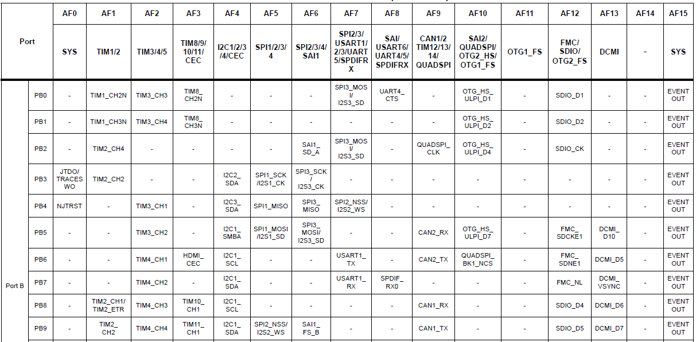

# General Purpose Input Output 

## GPIO là gì?
- `GPIO` là một chân tín hiệu kỹ thuật số trên mạch tích hợp mà hành vi của nó (đầu vào hoặc đầu ra) được điều khiển bởi phần mềm ứng dụng.  
- `GPIO` về cơ bản là một chân có thể được cấu hình làm đầu vào hoặc đầu ra. Nếu chúng ta cấu hình chân như một đầu ra, chúng ta có thể ghi 0 (LOW) hoặc 3,3 / 5 V (VDD) vào chân đó. Khi được cấu hình làm đầu vào, chúng ta có thể đọc tín hiệu trên chân đó.   
- `GPIO` là giao diện tiêu chuẩn mà qua đó vi điều khiển có thể giao tiếp với thế giới bên ngoài. Nó có thể được sử dụng để đọc các giá trị từ cảm biến analog hoặc kỹ thuật số, điều khiển đèn LED, điều khiển đồng hồ cho giao tiếp I2C,...  

## Bản đồ bộ nhớ của ngoại vi GPIO
- Như chúng ta đã biết rằng vi điều khiển hiện đại sử dụng kỹ thuật bản đồ bộ nhớ để ánh xạ tất cả các thiết bị ngoại vi trong một không gian bộ nhớ thống nhất. Vì bộ điều khiển STM32F446RE là bộ vi điều khiển dựa trên ARM Cortex M4 nên không gian bộ nhớ cho các thiết bị ngoại vi được ARM dành riêng như thể hiện trong hình:  
  
- Địa chỉ bộ nhớ trong khoảng từ `0x40000000` đến `0x600000000` có thể được nhà cung cấp vi điều khiển sử dụng để ánh xạ các thiết bị ngoại vi khác nhau của họ. Vùng này được chia thành nhiều vùng phụ, mỗi vùng được ánh xạ tới một thiết bị ngoại vi cụ thể, như thể hiện trong hình bên dưới. Từ góc độ lập trình viên, chúng ta cần tìm ra địa chỉ mà một thiết bị ngoại vi cụ thể được ánh xạ trong dải địa chỉ này. Datasheet của vi điều khiển sẽ cung cấp địa chỉ một thiết bị ngoại vi cụ thể được ánh xạ. Trong trường hợp của chúng ta, như chúng ta có thể thấy trong hình bên dưới, thiết bị ngoại vi GPIO được ánh xạ trong dải địa chỉ `0x40020000` đến `0x40021FFF`. Đây cũng là vùng băng tần bit (chúng ta sẽ tìm hiểu về điều này sau).  
  
- Như chúng ta thấy, GPIO ngoại vi được chia thành GPIO A, GPIO B, GPIO C, GPIO D, GPIO E, GPIO F, GPIO G, GPIO H và mỗi cổng chứa tối đa 16 chân. Ngoại vi GPIOA được ánh xạ từ địa chỉ 0x40020000 đến 0x400203FF và nó quản lý tất cả các chân kết nối với PORT-A.  
- Mẫu vi xử lý ARM Cortex M-4 có bus dữ liệu rộng 32 bit, bus địa chỉ và tập thanh ghi rộng 32 bit. Trên thực tế, mỗi từ có kích thước 32-bit. Biết được bus dữ liệu, bus địa chỉ và chiều rộng thanh ghi là rất quan trọng vì nó sẽ giúp hiểu mọi thứ ở cấp độ rất thấp (cơ bản) tức là cấp độ trình điều khiển. Vì chúng ta biết rằng kích thước từ là 4 byte, do đó chúng ta có thể nói rằng mọi thanh ghi của ngoại vi GPIO dài 4 byte.  
- Cho đến bây giờ, chúng ta đã tìm ra địa chỉ cơ sở của các thiết bị ngoại vi GPIO. Đó là điều đầu tiên bạn sẽ làm với tư cách là một lập trình viên bất cứ khi nào bạn định lập trình bất kỳ thiết bị ngoại vi nào là tìm địa chỉ cơ sở của thiết bị ngoại vi. Bây giờ, chúng ta cần biết địa chỉ thanh ghi chính xác để lập trình các thanh ghi. Trước khi bắt đầu lập trình các thanh ghi, chúng ta phải hiểu mục đích của các thanh ghi này.  

## Thanh ghi GPIO
- Tất cả các GPIO có trong vi điều khiển được nhóm lại thành Cổng X trong đó X là A, B, C, D ...  
- Mỗi cổng trong STM32F446RE bao gồm 16 chân. Mỗi chân có nhiều thanh ghi khác nhau được liên kết với nó, bằng cách thay đổi nội dung của các thanh ghi, chúng ta có thể kiểm soát hành vi của một chân cụ thể.  
- Trong STM32F446RE, hành vi của mỗi chân có thể được kiểm soát bằng cách sử dụng:  
    - Thanh ghi chế độ GPIO  
    - Thanh ghi loại đầu ra GPIO  
    - Thanh ghi tốc độ GPIO  
    - Thanh ghi kéo lên / kéo xuống GPIO  
    - Thanh ghi dữ liệu đầu vào GPIO  
    - Thanh ghi dữ liệu đầu ra GPIO  
    - Thanh ghi set / reset bit GPIO  
    - Thanh ghi khóa cấu hình GPIO  
    - Thanh ghi chức năng thay thế GPIO  

## Chi tiết về thanh ghi GPIO
- Thanh ghi chế độ GPIO được sử dụng để chọn chế độ của chân cắm.  
- Có bốn chế độ có thể được lập trình vào thanh ghi này:  
    - Chế độ đầu vào  
    - Chế độ đầu ra mục đích chung  
    - Chế độ chức năng thay thế  
    - Chế độ analog.  
- Khi phần mềm muốn đọc bất kỳ dữ liệu nào từ bên ngoài như cảm biến, nó đã định cấu hình chân cắm làm đầu vào. Mỗi chân có một bộ đệm đầu vào tương ứng mà phần mềm có thể đọc được khi chân đó đang hoạt động ở Chế độ INPUT. Chế độ Output được sử dụng khi chúng ta muốn ghi giá trị THẤP hoặc CAO vào chân.  
- `Ví dụ`: nếu chúng ta kết nối một đèn LED với một chân và chúng ta muốn bật đèn LED, phần mềm sẽ cấu hình chân đó là đầu ra và ghi HIGH (VDD) vào chân. Mỗi chân có một bộ đệm đầu ra tương ứng có thể được ghi bởi phần mềm, trong trường hợp này, chúng ta đang ghi 1 vào bộ đệm đầu ra. Chế độ chức năng thay thế được sử dụng khi chúng ta muốn gán một chân cụ thể cho bất kỳ thiết bị ngoại vi nào khác. Hãy chia nhỏ ra một cách đơn giản dễ hiểu với một ví dụ đơn giản. Ví dụ: Nếu bạn muốn sử dụng giao tiếp I2C, bạn sẽ cần hai chân là SDA và SCL. Bạn cần chọn một số chân cụ thể do nhà cung cấp vi điều khiển cung cấp, có thể được sử dụng như dòng I2C SDA và SCL. Bạn có thể lấy thông tin này từ datasheet thiết bị. Trong bảng dưới đây, bạn có thể thấy rằng đối với SCL ngoại vi I2C1, bạn có thể sử dụng Cổng B Chân 6 trong Chức năng Thay thế (AF) 4.  
  