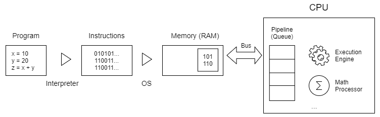
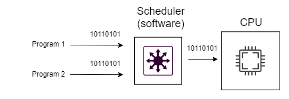

## Overview:
---
- Suppose that we have a simple python program </br>
```
x = 10
y = 20
z = x + y
```
- Computers don’t understand Python. They only understand machine code, which is a set of instructions containing zero and one. </br>
- Therefore, you need a Python Interpreter to execute this Python program, which translates the Python code to machine code. </br>
- When you execute the python app.py command, the Python interpreter (CPython) compiles the app.py file into machine code. And then the operating system (OS) needs to load the program into the memory (RAM) to run the program. </br>
- Once the OS loads the program to memory, it moves the instructions `(machine code)` to the CPU for execution via bus. </br>
- In general, the OS moves the instructions to a queue, also known as a pipeline. Then, the CPU will execute the instructions from the pipeline. </br>
- By definition, a process is an instance of a program running on a computer. And a thread is a unit of execution within a process. </br>
- Notice that if you launch a program multiple times, you’ll have a single program but multiple processes, each representing an instance of the program. </br>
```
A program is like a class while processes are like objects of the class.
```
- The following picture illustrates the flow of running a Python program on a computer: </br>
 </br>
- Sometimes the terms process and thread are often used interchangeably. </br>
- A program may have one or more processes and a process can have one or more threads. </br>
- When a program has multiple processes, it’s called `multiprocessing`. If a program has multiple threads, it’s called `multithreading`. </br>

## Single-core processors
---
- In the past, a CPU has only one core. In other words, it can run only a single process at one time. To execute multiple processes “at the same time”, the OS uses a software component called a scheduler: </br>
 </br>
- The `scheduler` is like a switch that schedules processes. The main task of the scheduler is to select the instructions and submit them for execution regularly. </br>
- The `scheduler` switches between processes so quickly (around 1 ms) that it creates the illusion of the computer being able to execute multiple processes simultaneously. </br>

## Multicore processors
---
- Today, the CPU often has multiple cores, e.g., two cores (dual-core) and four cores (quad-core). </br>
- The number of cores will determine the number of processes that the CPU can execute simultaneously. Generally, the more cores the CPU has, the more processes it can truly execute simultaneously. </br>
- For example, a dual-core CPU can execute exactly two processes simultaneously and a quad-core CPU can execute at most four processes simultaneously. </br>
- Multiprocessing uses a multi-core CPU within a single computer, which indeed executes multiple processes in parallel. </br>

## CPU-bound vs. I/O-bound tasks
---
- In general, programs deal with two types of tasks: `I/O-bound` or `CPU-bound`. </br>
    - `I/O-bound` tasks spend more time doing I/O than doing computations. The typical examples of `I/O-bound` tasks are network requests, database connections, and file reading/writing. </br>
    - In contrast, `CPU-bound` tasks use more time doing computation than generating I/O requests. The typical examples of `CPU-bound` tasks are matrix multiplication, finding prime numbers, video compression, and video streaming. </br>
- Technically, multithreading is suitable for `I/O-bound` tasks, and multiprocessing is suitable for `CPU-bound` tasks. </br>

## The main differences between processes and threads
- The following table illustrates the main differences between a process and a thread: </br>


| Criteria                         | Process                                    | Thread                                              |
| ----------------------------------- | -------------------------------------------- | ----------------------------------------------------- |
| **Memory Sharing**                | Memory is not shared between processes     | Memory is shared between threads within a process    |
| **Memory footprint**              | Large                                      | Small                                                |
| **CPU-bound & I/O-bound processing** | Optimized for CPU-bound tasks               | Optimized for I/O-bound tasks                        |
| **Starting time**                 | Slower than a thread                       | Faster than a process                                |
| **Interruptability**              | Child processes are interruptible          | Threads are not interruptible                        |
